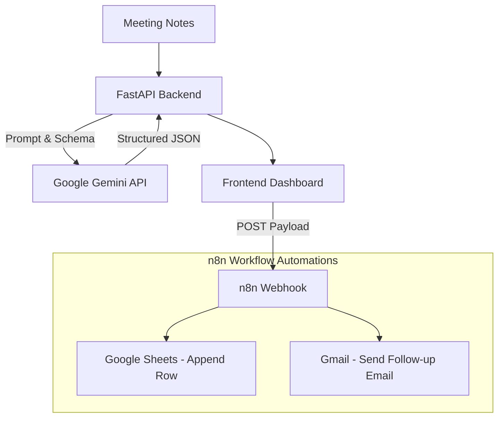

# OpsFlow AI – Internal Operations Assistant

OpsFlow AI is a complete production-style AI-powered Internal Operations Automation system. It takes raw, unstructured meeting notes, processes them using the Google Gemini API, and outputs a highly structured, actionable JSON format. The system also includes a professional frontend dashboard to view the generated summaries, action items, risks, and draft follow-up emails.

## 🚀 Features

- **Automated Summarization:** Instantly generates concise meeting summaries.
- **Action Item Extraction:** Identifies assigned tasks, employees, and deadlines.
- **Risk Identification:** Highlights potential risks or blockers discussed.
- **Email Generation:** Drafts a professional follow-up email ready to be sent to the team.
- **Structured Output:** Enforces strict JSON output schemas via the Gemini API.
- **n8n Webhook Integration:** Designed to easily forward processed data to n8n for further workflow automation (e.g., adding to Google Sheets, sending via Gmail).
- **Modern Dashboard:** Built with Vanilla HTML/CSS/JS featuring a sleek dark mode UI, smooth animations, and copy/download functionalities.

## 🏗 Architecture Diagram



## 📂 Folder Structure

```
OpsFlow-AI/
│
├── app/
│      __init__.py
│      main.py           # FastAPI application setup
│      routes.py         # API and HTML routes
│
├── services/
│      __init__.py
│      gemini_service.py # Gemini API integration and invocation
│
├── prompts/
│      __init__.py
│      meeting_prompt.py # System prompts for the LLM
│
├── models/
│      __init__.py
│      response_models.py# Pydantic schemas for JSON structured output
│
├── templates/
│      index.html        # Main dashboard UI
│
├── static/
│      style.css         # Custom dark-mode styles
│      script.js         # Frontend logic for API calls and DOM updates
│
├── screenshots/         # Place screenshots of the app here
├── README.md            # Project documentation
├── requirements.txt     # Python dependencies
└── .env                 # Environment variables (API Keys, Webhooks)
```

## ⚙️ Installation

1. **Clone or Download the Repository.**
2. **Navigate to the project directory:**
   ```bash
   cd OpsFlow-AI
   ```
3. **Create a virtual environment (optional but recommended):**
   ```bash
   python -m venv venv
   source venv/bin/activate  # On Windows use: venv\Scripts\activate
   ```
4. **Install the required dependencies:**
   ```bash
   pip install -r requirements.txt
   ```
5. **Configure Environment Variables:**
   - Open the `.env` file.
   - Replace `your_gemini_api_key_here` with your actual Google Gemini API key.
   - (Optional) Update the `N8N_WEBHOOK` if you have an active n8n instance.

## 🏃‍♂️ Running the Project

Start the FastAPI application using Uvicorn:

```bash
uvicorn app.main:app --reload
```

Then, open your web browser and navigate to:
`http://localhost:8000`

## 🔗 n8n Integration

1. Create a Webhook node in n8n.
2. Copy the Webhook URL provided by the node.
3. Paste the URL into the `.env` file under `N8N_WEBHOOK`.
4. Start the n8n workflow.
5. In the OpsFlow AI dashboard, process a meeting and click "📤 Send to n8n".

### Google Sheets Workflow
Documented recommended workflow to save data to a spreadsheet:
Webhook -> Set Node -> Google Sheets -> Append Row

Recommended Columns:
- Date
- Summary
- Priority
- Responsible Person
- Tasks
- Deadline

### Gmail Workflow
Documented recommended workflow to automatically email attendees:
Webhook -> Gmail Node -> Send Email

- **Subject**: Meeting Summary
- **Body**: Use the AI-generated `follow_up_email` field from the JSON payload.

## 🛠 Technologies Used
- **Backend:** Python, FastAPI, Pydantic
- **AI Model:** Google Gemini API (gemini-1.5-flash) with structured outputs.
- **Frontend:** HTML5, Vanilla CSS3, Vanilla JavaScript, FontAwesome, Google Fonts.

## 🔮 Future Improvements
- Add OAuth2 Authentication to secure the dashboard.
- Support uploading audio or video files to transcribe and summarize automatically.
- Connect directly to Google Calendar APIs to fetch the attendee list automatically.
